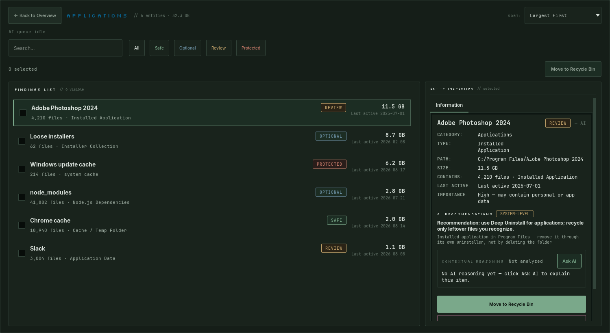

# Podbye

**Find out where your disk space actually went — without sending anything anywhere.**

Podbye scans your drives, works out what each folder actually *is*, and tells you
what is safe to remove and why. It runs entirely on your machine.

> **Beta.** It works and it is careful, but it is early. Back up anything you
> cannot lose, as you would with any tool that touches your files.



---

## Why another disk cleaner

Most cleaners ask you to trust them. Podbye is built so you don't have to.

**It never deletes permanently.** Every cleanup is a move to the Recycle Bin.
If Podbye gets something wrong, you get it back. Emptying the bin stays your
own, separate decision — and Podbye shows you how much is sitting in there,
because moving files to the bin doesn't free space until you empty it.

**It works entirely offline.** No telemetry, no analytics, no crash uploads,
no account. Nothing about your disk leaves your machine. That isn't a promise
in a privacy policy — it's enforced by a test that fails the build if any part
of the app so much as imports a networking library.

**It explains itself.** Every finding says why it was classified the way it
was: *"Known directory: node_modules"*, *"Installed application in Program
Files — remove it through its own uninstaller"*. If you disagree, you can
browse by folder instead and decide for yourself.

**It refuses to touch what matters.** System-critical paths are marked
Protected and cannot be selected for cleanup, ever.

**Optional local AI.** If you run [Ollama](https://ollama.com) or LM Studio,
Podbye can ask it to explain a finding in plain language. It only ever talks to
your own machine or your LAN — a public address is rejected outright. Leave it
off and everything else still works. What you get out of it depends heavily on
the model you point it at — see [About the AI explanations](#about-the-ai-explanations).

---

## Install

### The easy way

Download the latest release, unzip it anywhere, run `Podbye.exe`.

**[Download the latest release](../../releases/latest)**

Windows will show *"Windows protected your PC"* the first time. The build is
not code-signed yet (certificates cost money this project doesn't have).
Click **More info → Run anyway**. If you would rather verify first, every
release ships a `SHA256SUMS.txt`, and the binaries are built by GitHub Actions
from the public source — the build log is on the Actions tab.

### From source

```bash
git clone <this repo>
cd Podbye
python -m venv .venv
.venv\Scripts\pip install -r requirements.txt
.venv\Scripts\python -m app.main
```

Python 3.12+, Windows.

---

## What it does

- **Analyze** — scan a drive or folder. Results are grouped by what things
  are: applications, caches, dev artifacts, media, installers, duplicates.
- **Findings** — the detail. Filter by risk, sort by size or by what's safest
  to clean first, roll everything an app owns into one row, or drop into a
  plain folder tree when a label looks wrong.
- **Quick Cleanup** — the obvious wins (temp files, browser caches, thumbnail
  cache) with no thinking required.
- **Startups** — what launches with Windows, and whether you need it.
- **History** — what you cleaned, when, and how much came back.

---

## Languages

The interface ships in **English, Ukrainian and French**. That is not a
judgement about which languages matter — it is simply how far one person got.

Adding one is not hard. Translations live in `app/locales/<code>.json`, keyed
by the English string, and a *partial* file is genuinely useful: translated
strings appear in your language, everything else stays English, so you can
start with the screens you use most and stop whenever you like. Copy
`app/locales/fr.json`, translate the values, leave the keys alone, and open a
pull request. If pull requests are not your thing, open an issue and attach the
file — that is just as welcome, and I will wire it in.

Two things a translation has to keep: the `{placeholders}` in braces, exactly
as they appear in the key, and roughly the original length. Longer strings are
fine in a wrapping paragraph but will clip on a button, so `pytest` includes a
layout check that measures every control in every shipped language.

The language of *AI explanations* is separate, and set in AI settings. It is
deliberately not limited to the languages above — see below.

---

## Is it safe?

The honest answer, in order of how much it should reassure you:

1. Nothing is ever deleted permanently — it goes to the Recycle Bin.
2. Protected paths cannot be selected. Not "are discouraged" — cannot.
3. Cleanup targets are expanded to concrete files first, so a group row can
   never resolve to a drive root.
4. Files in use simply fail to move and stay where they are; Podbye tells you
   which ones and why.
5. The source is public, and there are 1000+ tests. Most of them exist because
   something went wrong once and shouldn't again.

It is still beta software that moves your files. Treat it accordingly.

---

## Privacy

Podbye collects nothing, sends nothing and phones home never. There is no
analytics SDK in the dependency list and no code path that could add one
quietly — `tests/test_offline_guarantee.py` fails the build if a module
outside the AI client imports networking, if a telemetry package appears in
`requirements.txt`, or if the AI endpoint stops being restricted to your own
machine and LAN.

Scan results are stored locally in `%APPDATA%\Podbye` so you can reopen them.
Delete that folder and Podbye forgets everything.

---

## License

**Source-available, free for non-commercial use** —
[PolyForm Noncommercial 1.0.0](LICENSE).

Use it, change it, share it, learn from it, for anything that isn't commercial.
Selling it, or building it into a paid product or service, is not covered.

To be precise about a term people care about: this is *not* "open source" in
the OSI sense, because that definition does not allow restricting commercial
use. The source is public and you are free to do almost anything with it — but
calling it open source would be inaccurate, so I don't.

Podbye bundles Qt (via PySide6) under the LGPL v3, psutil under BSD-3-Clause,
and three fonts under the SIL Open Font License. Those licenses grant you
rights that Podbye's own license cannot restrict. See
[THIRD-PARTY-NOTICES.md](THIRD-PARTY-NOTICES.md).

If Podbye saved you some disk space and you'd like to say thanks:
**[Ko-fi](https://ko-fi.com/nazarhetman)**. Entirely optional —
nothing is gated behind it, and nothing ever will be.

---

## For developers

- [DEVELOPMENT.md](DEVELOPMENT.md) — architecture and current status
- [SEMANTIC_PIPELINE.md](SEMANTIC_PIPELINE.md) — how classification works
- [BUILD.md](BUILD.md) — building, and why the build is a folder rather than
  one file (it's an LGPL requirement, please don't "fix" it)
- [DECISIONS.md](DECISIONS.md) — why things are the way they are

```bash
.venv\Scripts\python -m pytest -q      # 1000+ tests, ~2 minutes
```

Contributions are welcome. Note that contributed code is licensed under the
same noncommercial terms — if that's a problem for you, say so before you
start and we'll work it out.

---

## About the AI explanations

The AI is optional and entirely local, which means its quality is your model's
quality, not Podbye's. Worth knowing before you judge an answer:

**The model only knows what it was trained on.** A model trained in 2023 has
never heard of an application released in 2025, and will cheerfully guess.
Podbye's own classification does not depend on the model at all — the category,
the risk tier and the reason come from rules that run with the AI switched off.
The model is asked to *phrase* an explanation, not to decide anything. If the
prose and the label disagree, trust the label.

**Bigger models explain better; smaller ones are faster.** A 3B model gives you
a sentence. A 14B model gives you a paragraph that is usually right about what
an unfamiliar folder is for. Neither is wrong to choose — pick for your
hardware and patience.

**Language ability comes from the model, not from Podbye.** You can ask for an
explanation in any of the offered languages regardless of which interface
translations exist, because the constraint is what your model can write. A
model with weak coverage of a language will answer in it poorly, or drift back
to English mid-answer. If that happens, it is the model, and a larger or more
multilingual one will fix it.

**It never sees your files.** The prompt carries a path, a size, a category and
a timestamp — never file contents.

---

## Known limitations

- Windows only. Nothing is deliberately Windows-locked, but it is not tested
  elsewhere and several features (registry, Recycle Bin, startup entries) are
  Windows-specific.
- Not code-signed, so SmartScreen will warn on first run.
- A first full scan of a large drive takes a few minutes.
- **It has been tested on very few machines.** This is the honest one. Podbye
  has been built and run against a handful of Windows installs, and disk
  layouts vary enormously — different drive counts, different tools, different
  habits. Classification is rule-based, so a folder shape I have never seen can
  be sorted into the wrong category, or land in "Unknown" when it clearly is
  something. **If you see that, please
  [open an issue](../../issues/new/choose).** It is the single most useful
  thing you can contribute: every rule in here exists because a real folder on
  a real machine was classified wrongly once. Nothing is deleted without your
  say-so, so a wrong label costs you nothing but a wrong impression — and I
  cannot fix a layout I never see.
- Classification is good, not perfect. That's what the by-folder view is for.
